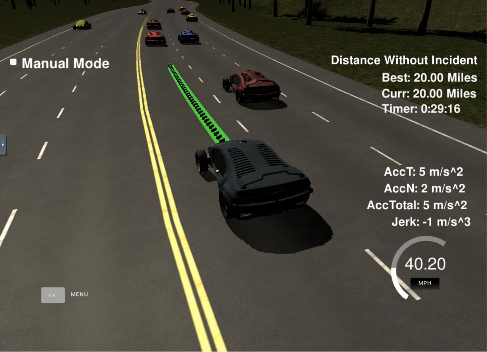

# **Highway Driving**

## Writeup by Matthew Jones

### Project: CarND-Path-Planning

---

**Path Planning Project**

The major steps taken to complete this project included:
* Reviewing **Highway Driving** project goals, project instructions and coding tips in the [Q&A video](https://youtu.be/7sI3VHFPP0w)
* Getting familiar with the commands needed in the Udacity workspace to compile project code and launch the driving simulator
* Using code from the Getting Started and More Complex Paths lesson segments to get my car moving
* Writing my code in __main.cpp__ as recommended by the Q&A video to enable my car to drive around the track  
* Adapting my code to ensure that my car does not violate any of the requirements defined in the [project rubric](https://review.udacity.com/#!/rubrics/1971/view)
* Explaining in detail the code in __main.cpp__ for generating paths **_[see below](#Reflection)_**

[//]: # (Image References)
__Screenshot from the driving simulator__  

---
### Writeup / README
Here is a link to my [project code](https://github.com/matttpj/CarND-Path-Planning)  

---
### Files Submitted

#### Submission includes all files required to run my car in the driving simulator

Key files are in source directory __src/*__:
 * Connects to the simulator and initiates path planning: __main.cpp__   
 * Calls the spline library for path planning: __spline.h__
 * Manipulate waypoints between Map (cartesian) and Frenet coordinate systems:  __helpers.h__
 * Manipulate JSON format data structures and messages:  __json.hpp__
 * C++ template library for linear algebra including use of matrices, vectors, numerical solvers etc..:  __Eigen-3.3/*__

---
### Compilation
The above source code compiles successfully in the Udacity workspace.

---
### Valid trajectories
| Criteria       		|     Specification	        					|    Status  |
|:---------------------:|:-------------------------------:|:--------:|
| The car is able to drive at least 4.32 miles without incident	| The top right screen of the simulator shows the current/best miles driven without incident. Incidents include exceeding acceleration/jerk/speed, collision, and driving outside of the lanes. Each incident case is also listed below in more detail.	|  PASS |
| The car drives according to the speed limit | The car doesn't drive faster than the speed limit. Also the car isn't driving much slower than speed limit unless obstructed by traffic. | PASS |
| Max Acceleration and Jerk are not Exceeded | The car does not exceed a total acceleration of 10 m/s^2 and a jerk of 10 m/s^3. | PASS |
| Car does not have collisions | The car must not come into contact with any of the other cars on the road. | PASS |
| The car stays in its lane, except for the time between changing lanes. | The car doesn't spend more than a 3 second length out side the lane lanes during changing lanes, and every other time the car stays inside one of the 3 lanes on the right hand side of the road. | PASS |
| The car is able to change lanes | The car is able to smoothly change lanes when it makes sense to do so, such as when behind a slower moving car and an adjacent lane is clear of other traffic. | PASS |

---
### Reflection
The code for Path Planning and Generating Paths is included in file **_main.cpp_** from line 76 onwards. An explanation of how the code works is provided below.

__Localization [line 79](https://github.com/matttpj/CarND-Path-Planning/blob/master/src/main.cpp#L79) >>__ The simulator provides information about position of my car on the track, including: x, y, s, d, theta, yaw, speed.

__Previous Path [line 88](https://github.com/matttpj/CarND-Path-Planning/blob/master/src/main.cpp#L88) >>__ The simulator provides previous path data sent to the path planner.

__Sensor Fusion [line 98](https://github.com/matttpj/CarND-Path-Planning/blob/master/src/main.cpp#L98) >>__ The simulator provides data about positions of other cars on my side of the track, including: id, x, y, vx, vy, s, d.  Use this data to calculate their velocity, proximity and lane position.

__Path Planning [line 161](https://github.com/matttpj/CarND-Path-Planning/blob/master/src/main.cpp#L161) >>__ Determine position of my car compared to other cars and then decide whether to change lane, speed up or slow down. This is something I struggled to achieve successfully without excessive Jerk or numerous if-else statements. I wasn't sure if I needed to implement an FSM.  However, the below linked solution by DarienMT showed me what could be achieved with some very simple logical arithmetic to compare lane numbers and I used this to derive my own solution.  
https://github.com/darienmt/CarND-Path-Planning-Project-P1/blob/master/src/main.cpp#L255

__Generating Paths [line 197](https://github.com/matttpj/CarND-Path-Planning/blob/master/src/main.cpp#L197) >>__ Create two initial reference points; either use my car's current position if the car has just set off or two previous points that were sent to the planner. Then define the next 3x future waypoints at 30m intervals up the road using Frenet coordinates and convert back to (x,y) map coordinates.

__Spline [line 265](https://github.com/matttpj/CarND-Path-Planning/blob/master/src/main.cpp#L265) >>__  Use the Spline external library to create a series of 50 (x,y) waypoints on the spline of the same previously generated path with a curve that ensures my car drives smoothly and does not exceed the speed limit or cause excessive Jerk acceleration given its reference velocity.

__Json Message [line 321](https://github.com/matttpj/CarND-Path-Planning/blob/master/src/main.cpp#L321) >>__ Construct a message in Json format to hold the (x,y) waypoint values which will be used to tell my car which path to follow.

__Web Sockets [line 328](https://github.com/matttpj/CarND-Path-Planning/blob/master/src/main.cpp#L328) >>__ Send message to the simulator.
